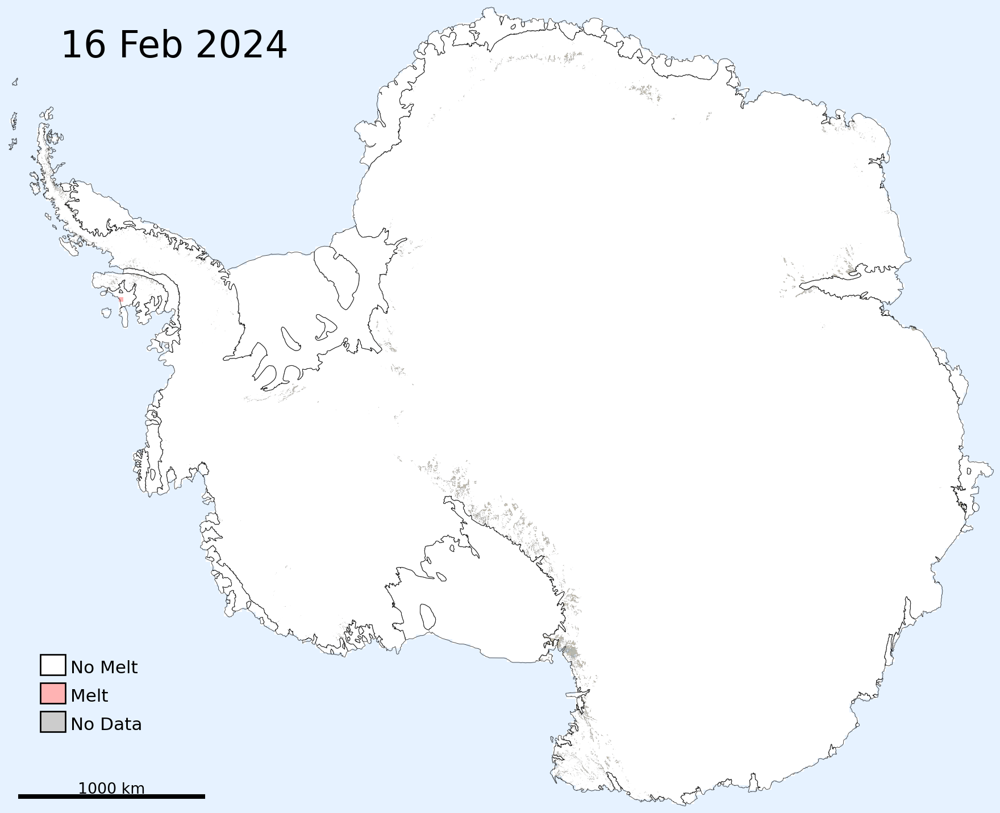
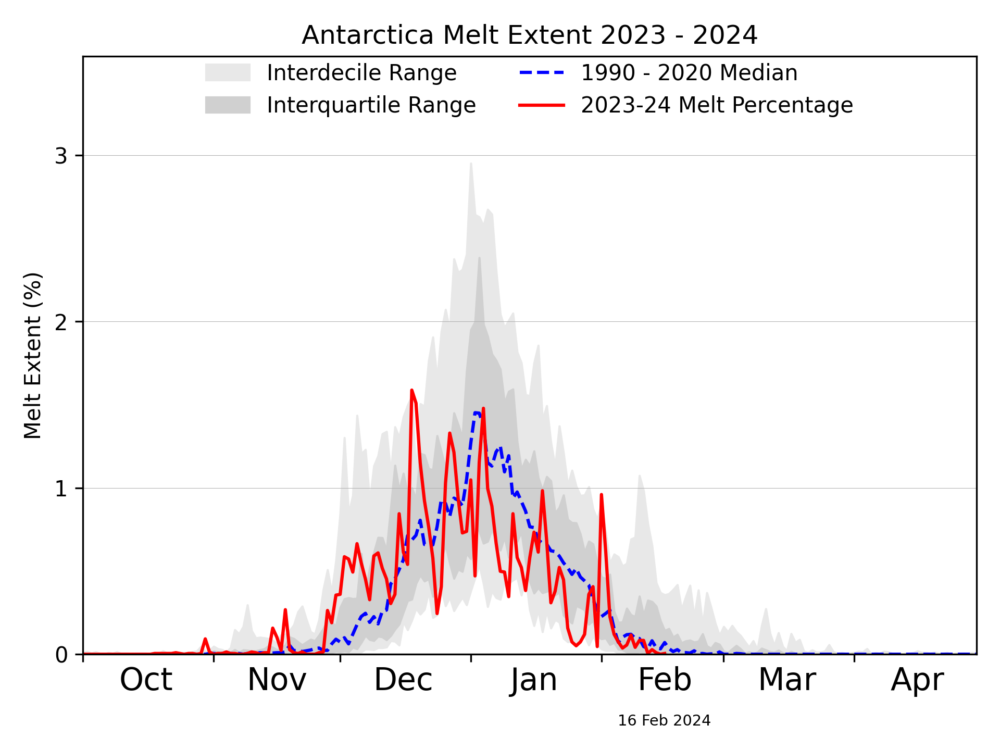
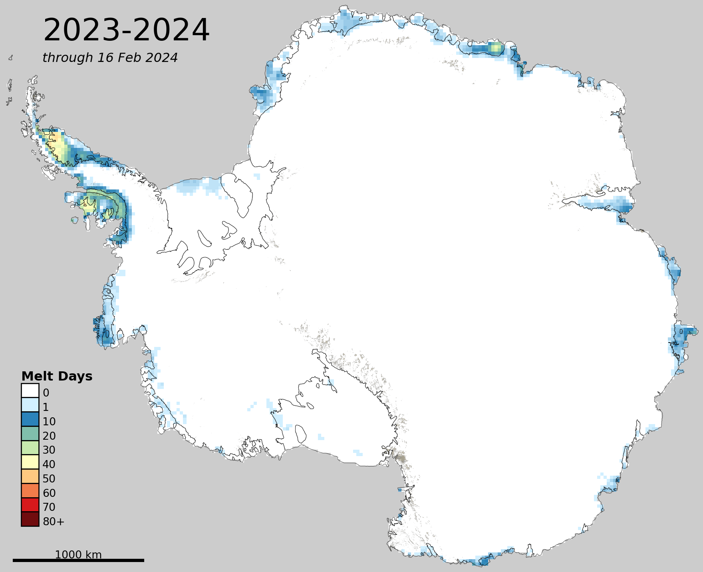
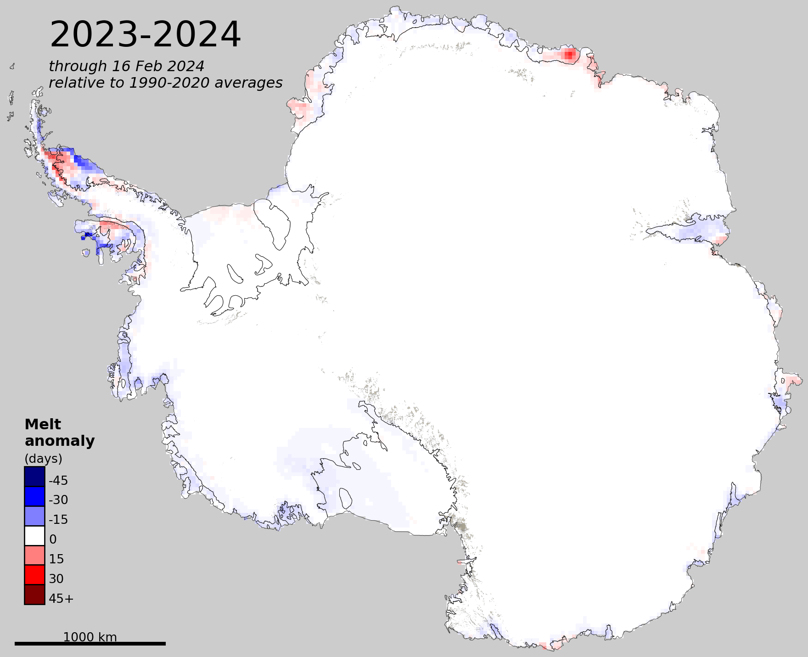

# Antarctica Today

by Dr. Mike MacFerrin, University of Colorado

Daily maps of surface melt extent on the Antarctic ice sheet during the austral melt season (Oct 1 to Apr 30), with a 1-day lag.

### **<!--date_long_start-->Friday, February 16, 2024<!--date_long_end-->**
<!--The "date_long_start" and "date_long_end" html-comment tags above are so the add_date_to_readme.py script can find and dynamically replace the date in this README.md every time the images are updated. Do not remove them unless the code no longer uses add_date_to_readme.py-->
<!--Same goes for the "contains_short_date_start" and "contains_short_date_end" comments below.-->
<!--Note: The "_start" tags and the "_end" tags should remain on the same line. The script searches line-by-line for both tags in a single text line.-->
<table>
  <tr>
    <td align='center' width='50%' padding='0px'><b>Daily Melt Extent:</b> 
<!--contains_short_date_start--><!--contains_short_date_end--></td>
    <td align='center' width='50%' padding='0px'><b>Seasonal Trend:</b> 
    <!--contains_short_date_start--><!--contains_short_date_end--></td>
  </tr>
  <tr>
    <td align='center' padding='0px'><b>Sum of Melt Days:</b> 
    <!--contains_short_date_start--><!--contains_short_date_end--></td>
    <td align='center' padding='0px'><b>Melt Anomaly</b> (compared to mean)<b>:</b> 
    <!--contains_short_date_start--><!--contains_short_date_end--></td>
  </tr>
</table>

Surface melt is derived from daily composites of passive-microwave satellite imagery combined with a microwave emission model based on a version for Greenland described in [Mote, et. al. (1993)](doi.org/10.3189/S0260305500012891) (and other publications). The original model for Greenland has been changed slightly to account for conditions in Antarctica. Melt extents are approximate and should be verified against ground conditions for operational use.

Images are generated using the [National Snow and Ice Data Center](https://nsidc.org/home)'s "[Antarctica Today](https://github.com/nsidc/Antarctica_Today)" codebase, which was originally created by Mike MacFerrin (University of Colorado) and has since been adopted, updated, and is currently being operationalized by the NSIDC. Special thanks to Thomas Mote for the modeling work, to Walt Meier, Elizabeth Cassano, Luis Lopez, and Matt Fisher at the NSIDC for continued development and help, and Ted Scambos for original funding and support. This repository runs Antarctica Today code daily and posts images both here in this repository and on social media (see running threads on [Mastodon](https://spore.social/@icesheetmike/111600065279948308) & [BlueSky](https://bsky.app/profile/icesheetmike.bsky.social/post/3kgry325kmf2r)). Annual microwave Tb thresholds are generated by Thomas Mote, University of Georgia. This code is currently maintained and run on a volunteer basis. The intent is for daily updates, but bugs or [insert any variety of life issues] may occasionally delay updates. We sincerely thank you for your patience.

This code and repository is open-source via [MIT License](https://github.com/mmacferrin/antarctica_today_social/blob/main/LICENSE).

©2023 Mike MacFerrin
