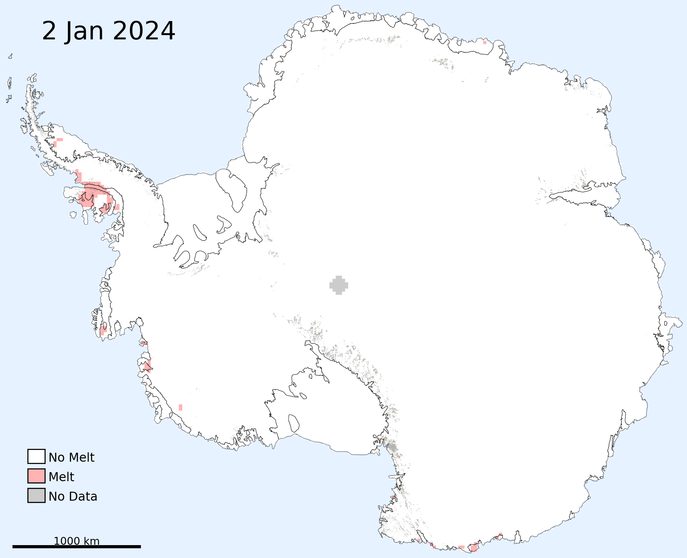
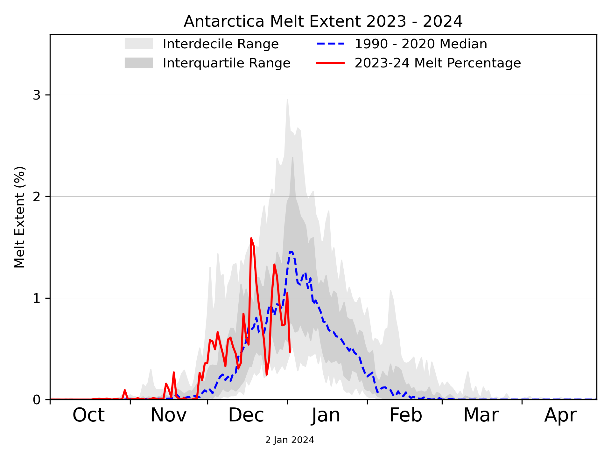
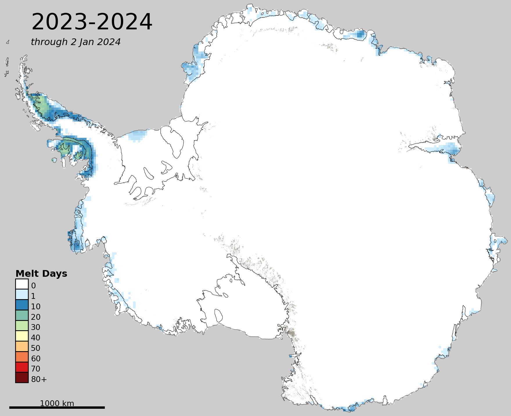

# Antarctica Today

by Dr. Mike MacFerrin, University of Colorado

Daily maps of surface melt extent on the Antarctic ice sheet during the austral melt season (Oct 1 to Apr 30), with a 1-day lag.

|  |  |
| ------------------------------------------------------------ | ------------------------------------------------------------ |
|  |  |

Surface melt is derived from daily composites of passive-microwave satellite imagery combined with a microwave emission model based on a modified version of [Mote, et. al. (1993)](doi.org/10.3189/S0260305500012891) (and other publications). The original model (used in Greenland) has been changed slightly for Antarctica. Melt extents are approximate and should be verified against ground conditions for operational use.

Images are generated using the [National Snow and Ice Data Center](https://nsidc.org/home)'s "[Antarctica Today](https://github.com/nsidc/Antarctica_Today)" codebase, which was originally created by Dr. Mike MacFerrin (University of Colorado) and has been adopted and updated by the NSIDC. Special thanks to Dr. Thomas Mote for the modeling work, as well as Walt Meier, Elizabeth Cassano, and Matt Fisher at the NSIDC for continued help and support. This repository runs Antarctica Today code daily and posts images here and on social media (see current threads on [Mastodon](https://spore.social/@icesheetmike/111600065279948308) & [BlueSky](https://bsky.app/profile/icesheetmike.bsky.social/post/3kgry325kmf2r)). Annual threshold files are generated by Dr. Thomas Mote, University of Georgia.

This code and repository is open-source via [MIT License](https://github.com/mmacferrin/antarctica_today_social/blob/main/LICENSE).

©2023 Mike MacFerrin